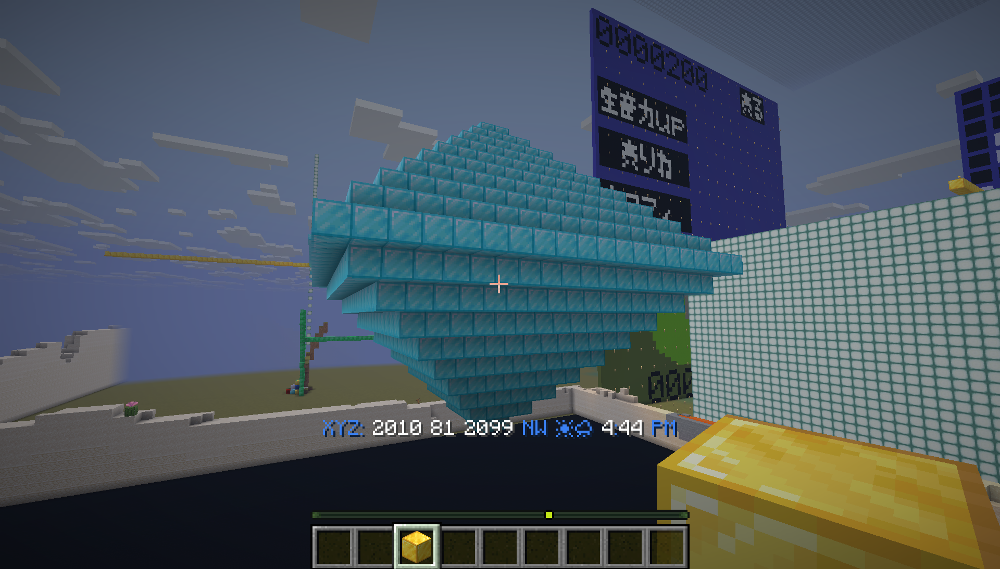
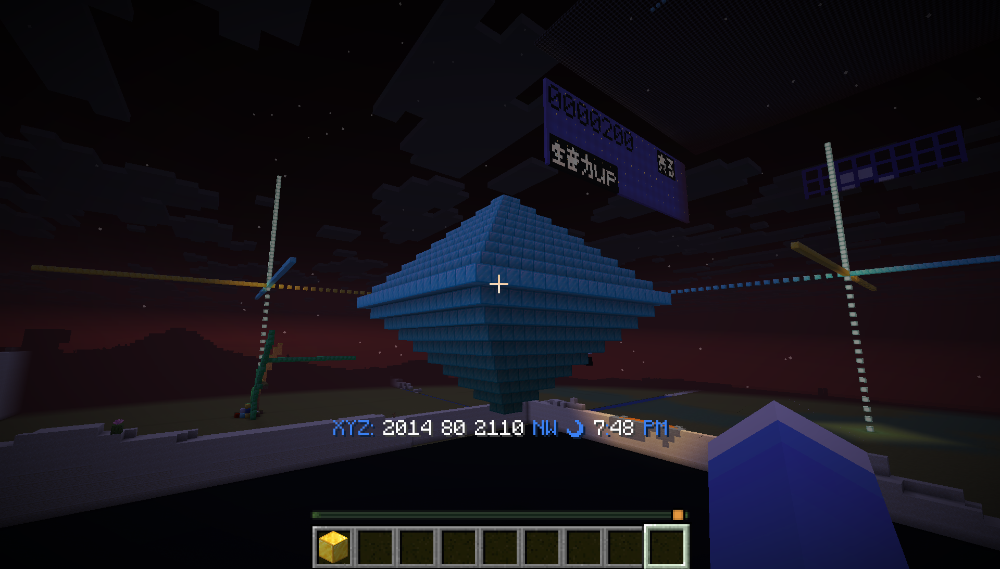
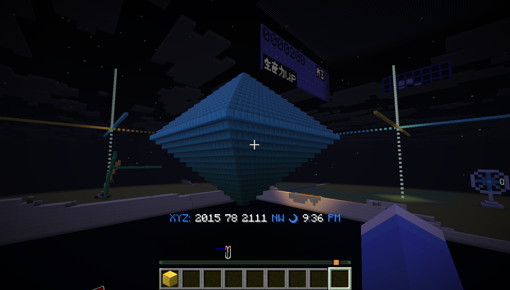
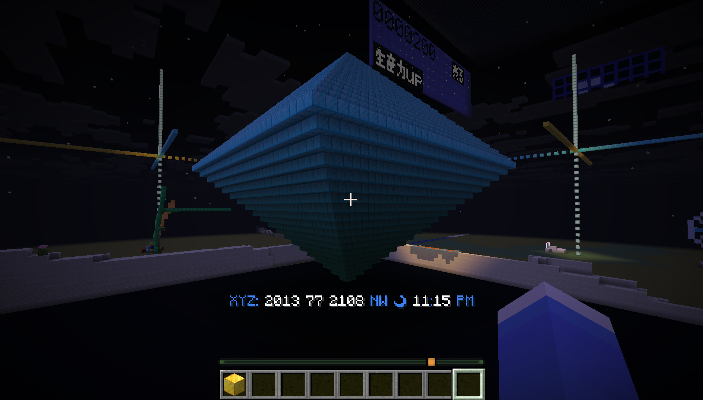

# API / soshi 0915

APIを使っていろんなものを再現させてみよう。
***
中間発表用プレゼンテーション

--

## このリポジトリの内容

APIを使って、ダイヤモンドを作る。

--

### README
  - ダイヤモンド
     

---

## ダイアモンド
  - プログラム
    - ```python
      from mc_remote.minecraft import Minecraft
      import param_mc_remote as param
      from param_mc_remote import PLAYER_ORIGIN as PO
      from param_mc_remote import block
      mc = Minecraft.create(address=param.ADRS_MCR, port=param.PORT_MCR)
      mc.setPlayer(param.PLAYER_NAME, PO.x, PO.y, PO.z)

      size=20
      size5=size
      x=0-size5
      y=85
      z=0-size5
      size2=size5
      for i in range(size2):
          x=0-size5
          for i in range(size2):
              z=0-size5
              for i in range(size2):
                  mc.setBlock(x,y,z, block.DIAMOND_BLOCK)
                  print(x,y,z)
                  z+=1
              x+=1
          y+=1
          size5-=1
          size2-=2

      size3=size
      x=0-size3
      y=85
      z=0-size3
      size4=size3
      for i in range(size4):
          x=0-size3
          for i in range(size4):
              z=0-size3
              for i in range(size4):
                  mc.setBlock(x,y,z, block.DIAMOND_BLOCK)
                  print(x,y,z)
                  z+=1
              x+=1
          y-=1
          size3-=1
          size4-=2

--

### プログラム解説

sizeの値を変更することで大きさを変えることができます。

ピラミッドを上と下につくり、それを重ねるようなかたちでプログラムは組んでいます。

--

- size=20
  - 

--

- size=30
  - 

--

- size=40
  - 

--

### それぞれの部分

- 上の部分
```python
size5=size
x=0-size5
y=85
z=0-size5
size2=size5
for i in range(size2):
    x=0-size5
    for i in range(size2):
        z=0-size5
        for i in range(size2):
            mc.setBlock(x,y,z, block.DIAMOND_BLOCK)
            print(x,y,z)
            z+=1
        x+=1
    y+=1
    size5-=1
    size2-=2
```

--

- 下の部分

```python
size3=size
x=0-size3
y=85
z=0-size3
size4=size3
for i in range(size4):
    x=0-size3
    for i in range(size4):
        z=0-size3
        for i in range(size4):
            mc.setBlock(x,y,z, block.DIAMOND_BLOCK)
            print(x,y,z)
            z+=1
        x+=1
    y-=1
    size3-=1
    size4-=2
```
