# API / soshi 0915

APIを使ってダイヤモンドを再現させよう。
***
卒業制作用プレゼンテーション

--

## このリポジトリの内容

・APIを使ってダイヤモンド型の建造物を作るプログラム

・そのプログラムの説明

・実際に生成されるダイヤモンドの画像 

--

### 実際の画像
  - ダイヤモンド
     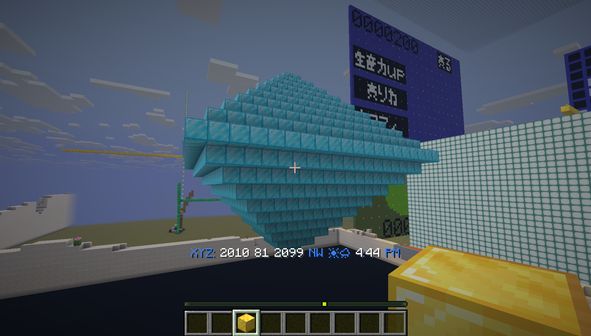

---

## ダイアモンド
  - プログラム
    - ```python
        from mc_remote.minecraft import Minecraft
        import param_mc_remote as param
        from param_mc_remote import PLAYER_ORIGIN as PO
        from param_mc_remote import block

        # 接続
        mc = Minecraft.create(address=param.ADRS_MCR, port=param.PORT_MCR)
        mc.setPlayer(param.PLAYER_NAME, PO.x, PO.y, PO.z)


        # ■ 周囲を球状に破壊
        def clear_sphere(mc, x0, y0, z0, r):
            for x in range(-r, r + 1):
                for y in range(-r, r + 1):
                    for z in range(-r, r + 1):
                        if x*x + y*y + z*z <= r*r:
                            mc.setBlock(x0 + x, y0 + y, z0 + z, block.AIR)


        # ■ ダイヤ型（中央1ブロック）
        def set_diamond(mc, x0=0, y0=param.Y_SEA + 10, z0=0, size=5, block_id=block.DIAMOND_BLOCK):
            # 周囲破壊
            clear_sphere(mc, x0, y0, z0, size + 2)

            # 上（頂点 → 中央）
            for y in range(size):
                d = size - y - 1
                for x in range(-d, d + 1):
                    for z in range(-d, d + 1):
                        mc.setBlock(x0 + x, y0 + y, z0 + z, block_id)

            # 下（中央の下からスタートして尖る）
            for y in range(1, size):  # ←ここが変更ポイント
                d = size - y - 1
                for x in range(-d, d + 1):
                    for z in range(-d, d + 1):
                        mc.setBlock(x0 + x, y0 - y, z0 + z, block_id)


        # 実行
        mc.postToChat("Building diamond shape...")
        set_diamond(mc, x0=0, z0=0, size=6, block_id=block.GOLD_BLOCK)  # ここのblockを変えるとブロックの種類が変わる
    

--

### プログラム解説

sizeの値を変更することで大きさを変えることができます。

１、接続する

２、周囲を球状に破壊する

３、中央から上にピラミッドを作る

４、中央の下から下向きのピラミッドをつくる

５、実行する

---

- size=4
  - 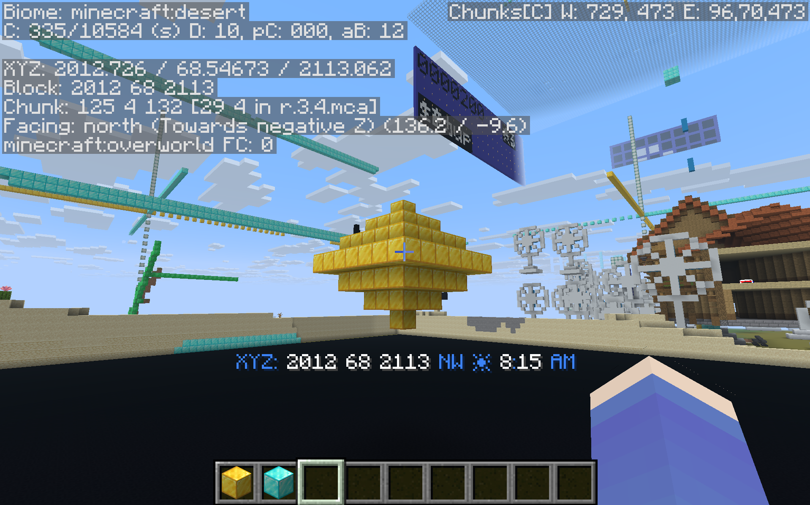

--

- size=6
  - 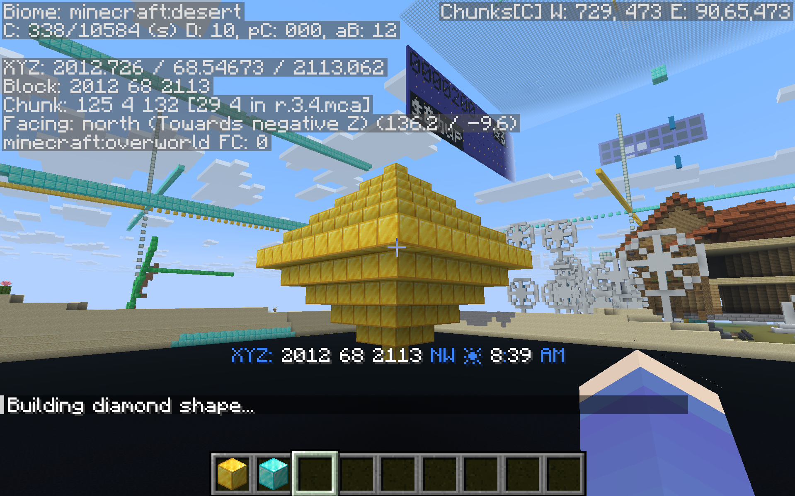

--

- size=10
  - 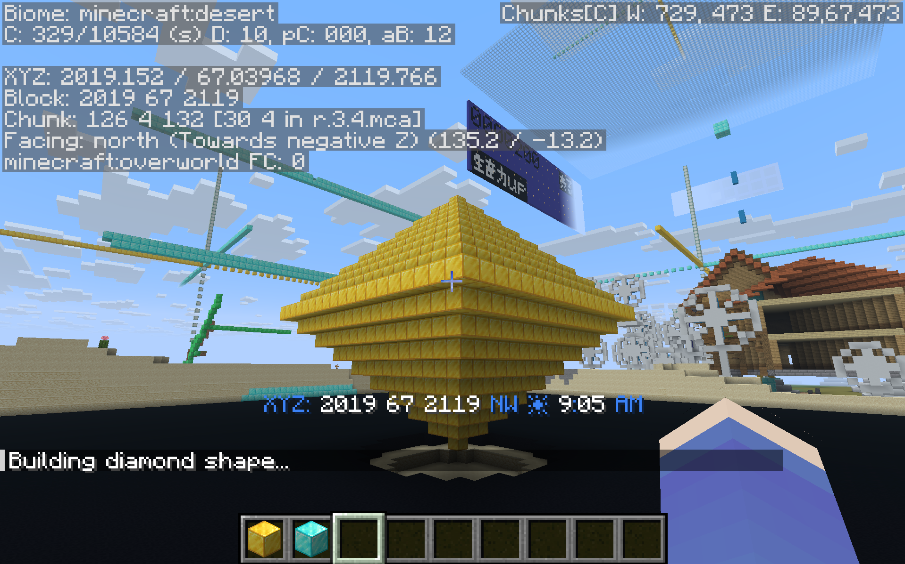

---

- block_id=block.COPPER_BLOCK
  - 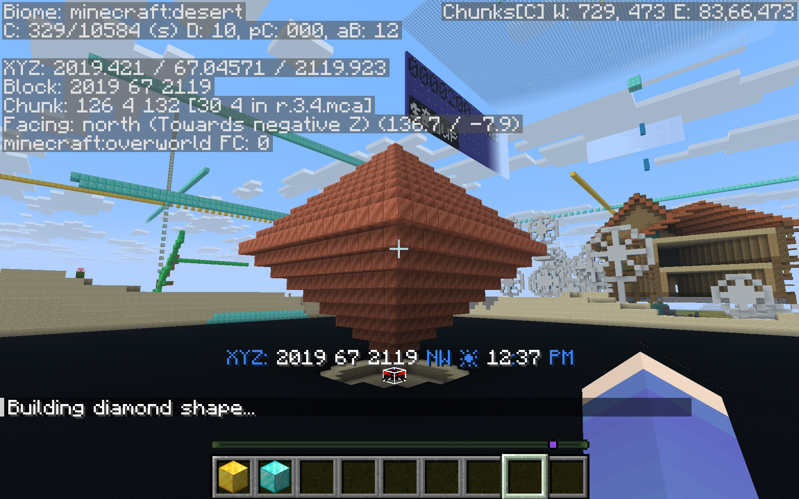

--

- block_id=block.DIAMOND_BLOCK
  - 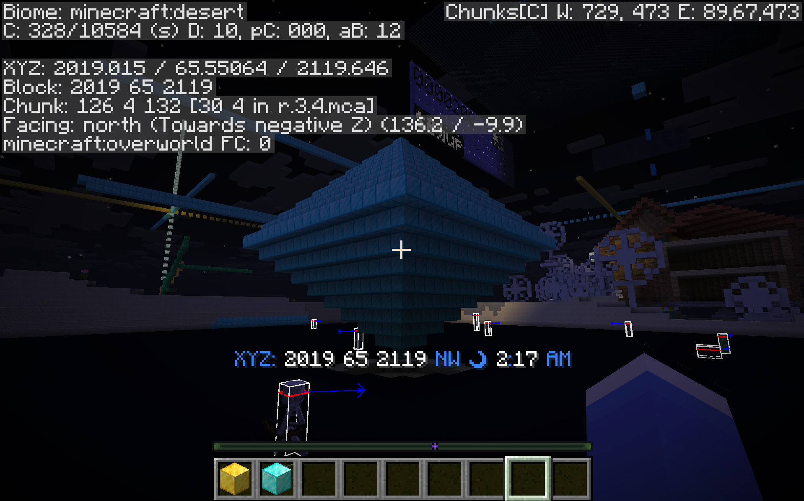

--

- block_id=block.GLOWSTONE
  - 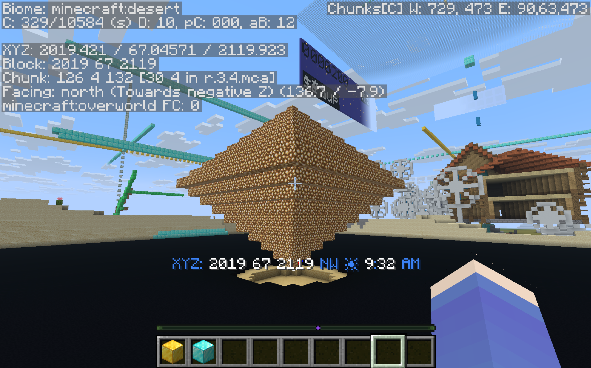

---

- x=30
  - 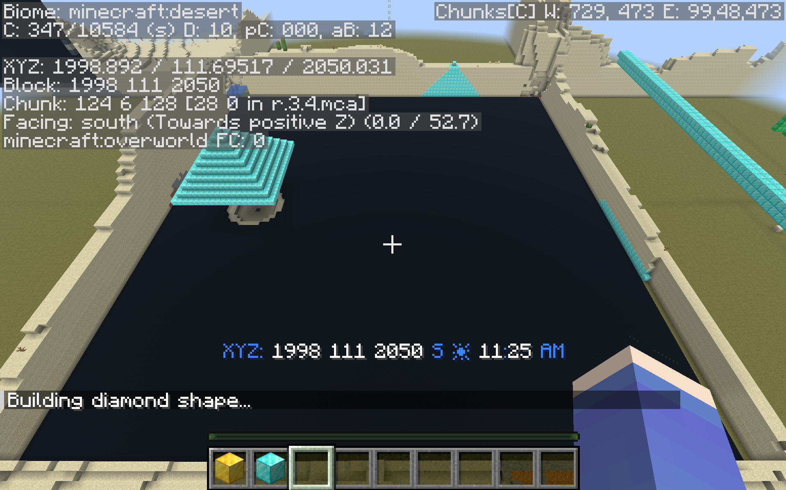

--

- x=-30
  - 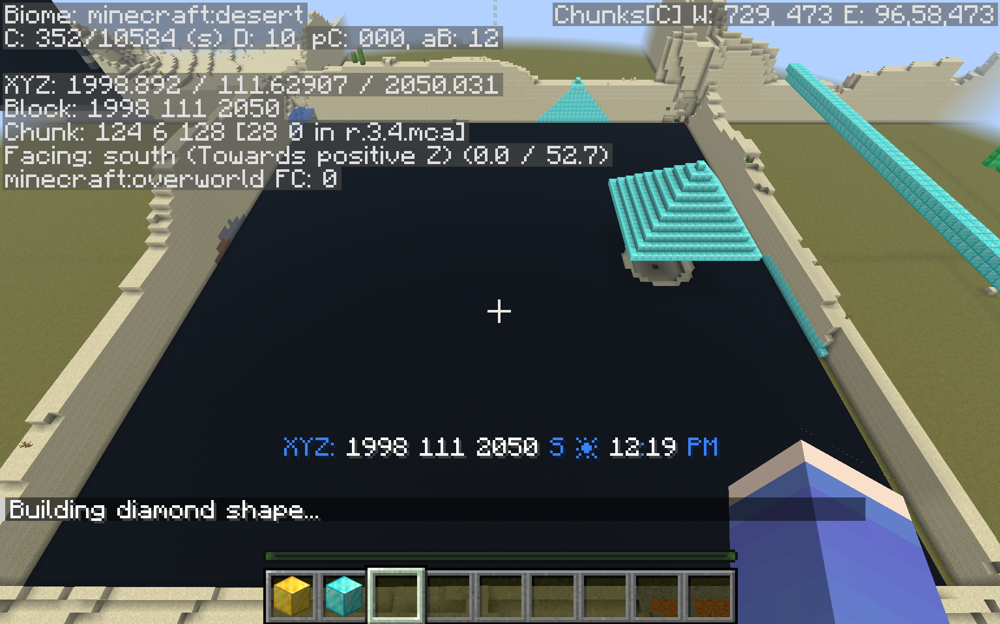

--

- z=30
  - 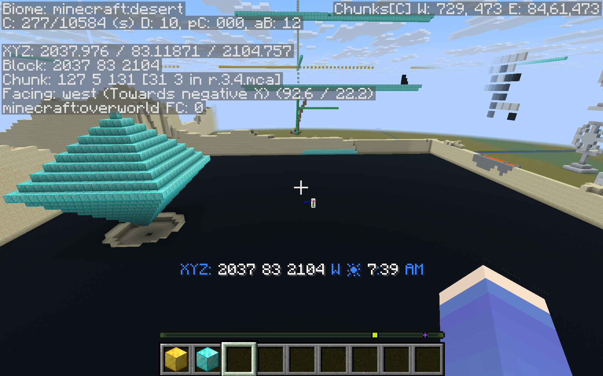

--

- z=-30
  - 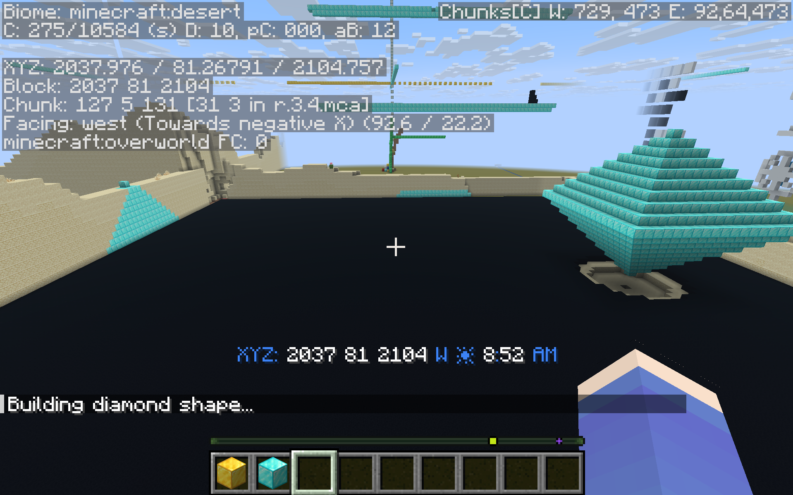

---

### それぞれの部分

- 上の部分
```python
    for y in range(size):
        d = size - y - 1
        for x in range(-d, d + 1):
            for z in range(-d, d + 1):
                mc.setBlock(x0 + x, y0 + y, z0 + z, block_id)
```

--

- 下の部分

```python
    for y in range(1, size):
        d = size - y - 1
        for x in range(-d, d + 1):
            for z in range(-d, d + 1):
                mc.setBlock(x0 + x, y0 - y, z0 + z, block_id)
```
